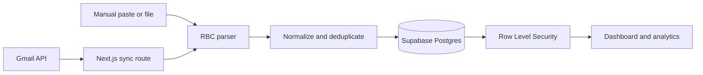

# Northstar

[](https://github.com/jaknowles18/northstar_finance/actions/workflows/ci.yml)
[](https://northstar-finance.vercel.app/demo)
[](LICENSE)

Northstar is a privacy-minded spending analyzer that turns RBC purchase-alert emails into a categorized, searchable view of day-to-day card spending.

**[Explore the fictional-data demo](https://northstar-finance.vercel.app/demo)** · **[Open the deployed app](https://northstar-finance.vercel.app)**

## Why I built it

Purchase alerts are useful in the moment, but they do not answer broader questions: How much have I spent this month? Which categories are driving it? What still needs review?

Northstar converts those alerts into a lightweight personal ledger without claiming access to balances or storing raw email bodies. The product is designed around a short daily workflow: review the overview, resolve uncategorized purchases, and explore the underlying transactions when needed.

## Product highlights

- **Gmail ingestion:** OAuth 2.0 connection, exact-subject filtering, unread-message sync, and automatic read-state updates after processing.
- **Defensive parsing:** Handles RBC purchase notifications, forwarded-message batches, merchant normalization, dates, currencies, and malformed input.
- **Actionable dashboard:** Current-period spending, previous-period comparison, category drivers, billing projection, and recent activity.
- **Review workflow:** Apply a category to one purchase, matching historical purchases, or future imports through merchant rules.
- **Deep Dive analytics:** Date, category, merchant, amount, source, weekday, recurrence, and text filters with traceable source rows.
- **Privacy controls:** Per-user Row Level Security, encrypted refresh tokens, in-memory email parsing, and duplicate detection.
- **Responsive UI:** Keyboard-visible focus, accessible chart summaries, mobile transaction layouts, and explicit loading/error/empty states.

## Engineering highlights



The codebase demonstrates:

- Next.js App Router with server-rendered data views and route handlers.
- TypeScript domain models and pure analytics functions that are independently testable.
- Supabase Auth, Postgres constraints, indexes, migrations, and user-scoped RLS policies.
- OAuth state signing, AES-256-GCM refresh-token encryption, and server-only token exchange.
- Idempotent imports through a per-user SHA-256 transaction fingerprint and unique database index.
- Product decisions documented in [`docs/redesign-brief.md`](docs/redesign-brief.md), including accessibility and information-architecture rationale.

## Technology

| Layer | Tools |
| --- | --- |
| Frontend | Next.js 15, React 19, TypeScript, Tailwind CSS, Recharts |
| Backend | Next.js route handlers, Supabase Auth, PostgreSQL |
| Integrations | Google OAuth 2.0, Gmail API |
| Quality | Node assertion tests, TypeScript build checks, GitHub Actions |
| Deployment | Vercel |

## Run locally

Requirements: Node.js 20 or newer and npm.

```bash
git clone https://github.com/jaknowles18/northstar_finance.git
cd northstar_finance
npm install
cp .env.example .env.local
npm run dev
```

Open [http://localhost:3000/demo](http://localhost:3000/demo) to view the fictional-data demo without configuring external services.

Run the verification suite with:

```bash
npm test
npm run build
```

## Full application setup

### 1. Supabase

Create a Supabase project and add its public project values to `.env.local`:

```env
NEXT_PUBLIC_SUPABASE_URL=
NEXT_PUBLIC_SUPABASE_ANON_KEY=
```

Run these files in the Supabase SQL editor:

1. `supabase/schema.sql`
2. `supabase/policies.sql`
3. `supabase/auth-categories-migration.sql`
4. `supabase/billing_settings.sql`
5. `supabase/gmail-connection-migration.sql`
6. `supabase/transaction-amount-adjustment.sql`

### 2. Gmail OAuth

Enable the Gmail API and create a Google OAuth **Web application** client. Add this exact authorized redirect URI for local development:

```text
http://localhost:3000/api/gmail/callback
```

Then configure:

```env
GOOGLE_CLIENT_ID=
GOOGLE_CLIENT_SECRET=
GOOGLE_REDIRECT_URI=http://localhost:3000/api/gmail/callback
GMAIL_TOKEN_ENCRYPTION_KEY=
```

Generate a long random encryption key and keep it stable. Changing it intentionally invalidates the application’s ability to decrypt existing Gmail connections. For production, use the deployed HTTPS callback URI instead of localhost.

## Privacy and security

- Secrets and local environment files are ignored and must never be committed.
- The browser receives only the Supabase anonymous key; no service-role key is used.
- Database policies restrict user-owned rows to the authenticated account.
- Gmail refresh tokens are encrypted before database storage.
- Matching email bodies are parsed in memory and are not retained.
- The Gmail scope is `gmail.modify` because processed messages are marked as read.

This project summarizes user-imported transaction alerts. It is not financial advice and does not represent an official bank balance or statement.

## Project status

Northstar is an actively developed portfolio project. The core import, categorization, analytics, authentication, and Gmail sync workflows are implemented. Potential next steps include broader bank-format support, automated accessibility checks, and expanded integration tests.

## License

Released under the [MIT License](LICENSE).
